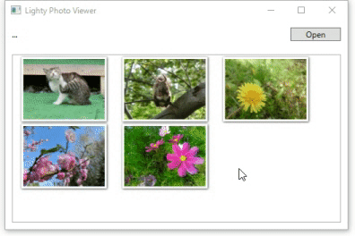
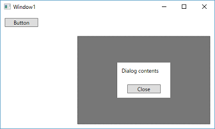

# Lighty
Lighty is customizable lightbox library for WPF.



## Features

* Lighty shows dialog on the same visual tree using adorner.
    * Need not to create special elements for Lighty in your xaml code.
* 3way to show lightbox.
    * Show(): show lightbox in modeless format.
    * ShowAsync(): awaitable version of Show() method. 
    * ShowDialog(): Show light box modally, like a System.Windows.Window.ShowDialog() method.
* Can contain any FrameworkElement class in lightbox.(eg. Image / UserControl / etc...)
* Show/Close lightbox with animation.
* Lightbox style can be customized by setting default style of LightBox class.


## Install
Clone project and build it, then add reference to your own projects.

Or, you can install Lighty by Nuget.
```
Install-Package Lighty
```

## Usage

### Preparation
#### code
Add using syntax for lighty namespace.
```cs
using SourceChord.Lighty;
```

#### XAML
Add xmlns to xaml code.
```xml
xmlns:lighty="clr-namespace:SourceChord.Lighty;assembly=Lighty"
```

### Show Lightbox

```cs
        private void OnClickButton(object sender, RoutedEventArgs e)
        {
            // show UserControl(SampleDialog is derived from UserControl.)
            LightBox.Show(this, new SampleDialog());

            // show FrameworkElement.
            var image = new Image();
            image.Source = new BitmapImage(new Uri("Images/1.jpg", UriKind.Relative));
            LightBox.Show(this, image);
        }
```


### Modal, Modeless, Async way to show lightbox

```cs
        private async void OnClickButton(object sender, RoutedEventArgs e)
        {
            // modeless dialog
            LightBox.Show(this, new SampleDialog());

            // async method
            await LightBox.ShowAsync(this, new SampleDialog());

            // modal dialog
            LightBox.ShowDialog(this, new SampleDialog());
        }
```

### showing light box into selected area
Lighty is able to show lightbox into anywhere under xaml's visual tree.

The below is a sample code to show lightbox in Grid control.
```xml
<Window x:Class="LightySample.Window1"
        xmlns="http://schemas.microsoft.com/winfx/2006/xaml/presentation"
        xmlns:x="http://schemas.microsoft.com/winfx/2006/xaml"
        xmlns:d="http://schemas.microsoft.com/expression/blend/2008"
        xmlns:lighty="clr-namespace:SourceChord.Lighty;assembly=Lighty"
        xmlns:local="clr-namespace:LightySample"
        xmlns:mc="http://schemas.openxmlformats.org/markup-compatibility/2006"
        Title="Window1"
        Width="500"
        Height="300"
        mc:Ignorable="d">
    <Grid>
        <Button x:Name="button"
                Width="75"
                Margin="10,10,0,0"
                HorizontalAlignment="Left"
                VerticalAlignment="Top"
                Click="button_Click"
                Content="Button" />
        <Grid x:Name="subGrid"
              Width="300"
              Height="200"
              Margin="10"
              HorizontalAlignment="Right"
              VerticalAlignment="Bottom" />
    </Grid>
</Window>
```

``` cs
        private void button_Click(object sender, RoutedEventArgs e)
        {
            LightBox.Show(this.subGrid, new SampleDialog());
        }
```




### Styling
#### Change lightbox styles
You can customize lightbox by editing below properties.

|Property|Description|
|-----|-----|
|Template||
|ItemsPanel||
|ItemContainerStyle||
|CloseOnClickBackground|Sets a value that indicating whether to close lightbox on click background.(dafault value is True)|

#### create your own styles
You can create your own styles for light box.
The way to create style is defining default style to LightBox class.

##### Example
```xml
    <Window.Resources>
        <Style TargetType="{x:Type lighty:LightBox}">
            <Setter Property="Template">
                <Setter.Value>
                    <ControlTemplate>
                        <Grid Background="#88F5F5DC">
                            <ItemsPresenter />
                        </Grid>
                    </ControlTemplate>
                </Setter.Value>
            </Setter>
        </style>
        <Setter Property="CloseOnClickBackground" Value="False" />
    </Window.Resources>
```


#### Animations
Lighty can customize animation by set below properties.

|Property|Description|
|-----|-----|
|InitializeStoryboard|Sets an animation for showing lightbox's background.|
|DisposeStoryboard|Sets an animation for hiding lightbox's background.|
|OpenStoryboard|Sets an animation for showing lightbox's content.|
|CloseStoryboard|Sets an animation for hiding lightbox's content.|


##### parallel execution
Lighty executes InitializeStoryboard & OpenStoryboard sequentially.
(same as CloseStoryboard & DisposeStoryboard)

If you want to excecute InitializeStoryboard & OpenStoryboard in parallel, set `IsParallelInitialize="True"`.

|Property|Description|
|-----|-----|
|IsParallelInitialize|Sets a value that determines whether InitializeStoryboard & OpenStoryboard should execute in parallel.|
|IsParallelDispose|Sets a value that determines whether CloseStoryboard & DisposeStoryboard should execute in parallel.|

#### builtin styles
Lighty provides some usefull built in styles.

|Property|Name|
|-----|-----|
|Template|DarkBackgroundTemplate|
||LightBackgroundTemplate|
||DarkGlassTemplate|
||LightGlassTemplate|
|ItemsPanel|HorizontalPanel|
||VerticalPanel|
|ItemContainerStyle|ClosableContainerStyle|
||PhotoCardStyle|
|Animations|FadeInAnimation|
||FadeOutAnimation|
||ZoomInAnimation|
||ZoomOutAnimation|

##### Example
```xml
    <Window.Resources>
        <Style TargetType="{x:Type lighty:LightBox}">
            <Setter Property="Template" Value="{StaticResource DarkBackgroundTemplate}" />
            <Setter Property="ItemsPanel" Value="{StaticResource HorizontalPanel}" />
            <Setter Property="ItemContainerStyle" Value="{StaticResource PhotoCardStyle}" />
        </Style>
    </Window.Resources>
```

## Lisence
[MIT](LICENSE)
